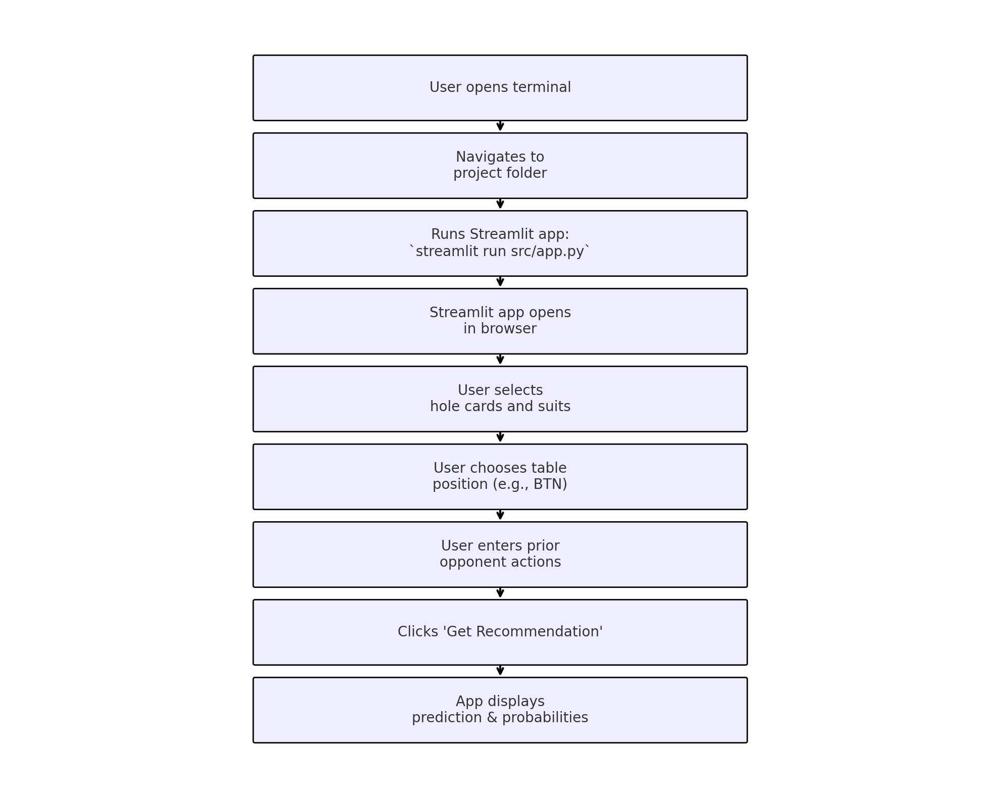
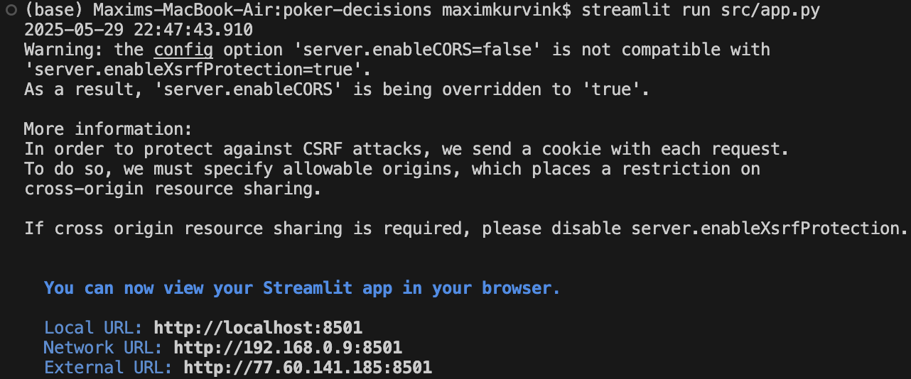
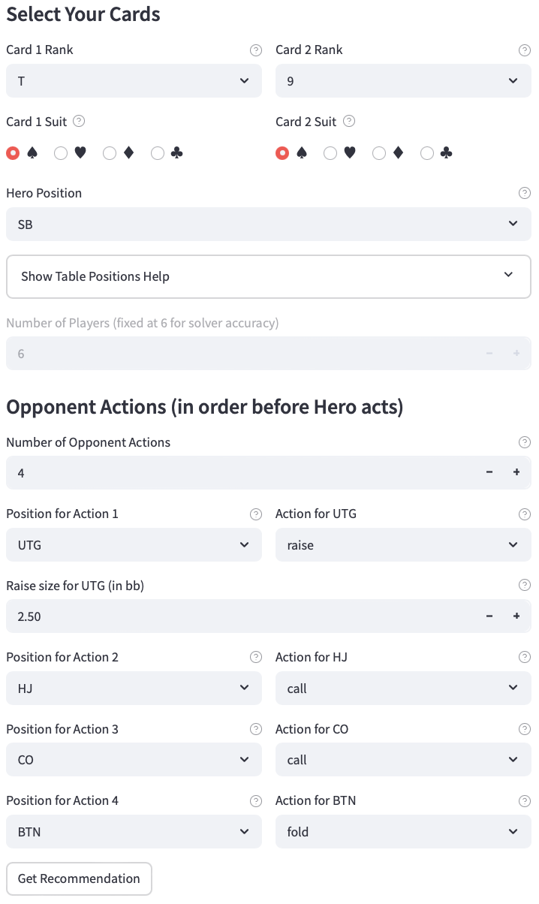
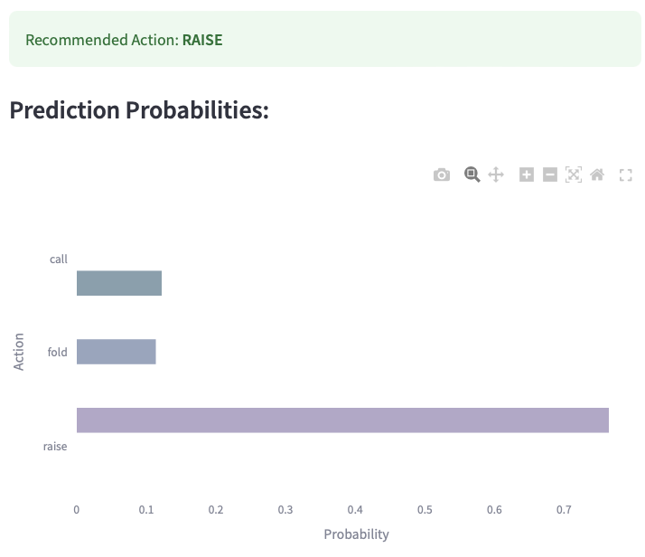

# HoldemHelper Package

HoldemHelper is a Python package for making statistically grounded poker decisions in 6-player Texas Hold'em. It includes functions for generating training data, evaluating scenarios, and inferring preflop actions using a trained machine learning model.

While a Streamlit app is provided for demonstration and interactive use, the core functionality is designed to be used as a standalone Python package.

---

## Overview

This project combines expert strategy charts, synthetic data augmentation, and machine learning to recommend optimal plays—fold, call, or raise—based on:

- Your hand (hole cards)
- Your position at the table
- Opponent betting actions before your turn

The package can be used programmatically or via an optional Streamlit interface.

---

## Machine Learning

- Trains an XGBoost classifier using both real and synthetic data.
- Encodes hand, position, and game context into predictive features.
- Evaluates model performance and handles edge-case scenarios.

---

## Features

- Input card ranks and suits via an intuitive UI.
- Track and encode opponent betting history.
- Visualize recommendation probabilities as bar charts.
- Improve model generalization using strategically crafted synthetic data.

---

## User Scenario

**Purpose:** Demonstrate how a typical user interacts with the HoldemHelper software to receive a recommendation for a preflop decision.

**User:** Student A, a Research Master's student in Psychology at the University of Amsterdam, exploring decision-making models and poker strategies.

**Assumptions:**

- Python 3.9+ is installed.
- The HoldemHelper package is locally installed.
- A terminal and web browser are available.

**Scenario Steps:**

1. Student A navigates to the project folder using the terminal.
2. Runs `streamlit run src/app.py` to start the app.
3. The app opens in a browser, displaying an input interface.
4. They select `"Q"` and `"J"` as ranks, both suited hearts.
5. Chooses `"BTN"` (Button) as their position.
6. Inputs actions: `"UTG/fold"`, `"HJ/raise"`, `"CO/call"`.
7. Clicks **Get Recommendation**.
8. The app shows: **Recommended Action: call** and a probability chart.
9. Student A repeats the process with different inputs to explore optimal strategies.

---

## Installation

Clone the repository and install dependencies using pip:

```bash
git clone https://github.com/Programming-The-Next-Step-2025/poker-decisions.git
cd poker-decisions
pip install -e .
```

---

## Example: Using the Package in a Script

```python
import HoldemHelper

decision, probs = HoldemHelper.recommender.recommend(
    hero_holding = "Th9h", 
    hero_pos = "CO", 
    prev_line = "UTG/call/HJ/2.5bb", 
    num_players = 6
    )
print("Decision:", decision)
print("Probabilities:", probs)
```

> Make sure to run this script with the Python version where HoldemHelper was installed (e.g., Python 3.12):

```bash
python3.12 my_script.py
```

---

## Running the Streamlit Web App

To launch the app locally:

1. Ensure you're in the project directory and using Python 3.12.
2. Confirm that Streamlit is up-to-date (v1.25.0+). To upgrade:

```bash
pip install --upgrade streamlit
# Or with conda:
conda update streamlit
```

3. Launch the app:

```bash
python3.12 -m streamlit run src/app.py
```

Once launched, the app will open in your browser. You can:

- Select two cards (rank and suit)
- Choose your position (UTG, HJ, CO, BTN, SB, BB)
- Enter prior actions (e.g., `UTG/fold`, `HJ/raise`)
- Click **Get Recommendation**
- View a probability chart for fold, call, or raise

---

## Training the Model

To regenerate training data and retrain the model:

```bash
python src/HoldemHelper/import_dataset.py
```

This creates the following files in the `model/` directory:

- `poker_model.pkl`
- `label_encoder.pkl`
- `feature_columns.pkl`

---

## Project Structure

```
poker-decisions/
├── src/
│   ├── app.py                  # Streamlit app UI
│   └── HoldemHelper/
│       ├── import_dataset.py   # Dataset generation & model training
│       ├── recommend.py        # Prediction logic
│       ├── hand_strengths.py   # Predefined hand strengths
│       └── ...                 # Additional utilities
├── model/                      # Trained model artifacts (.pkl)
├── src/images/                 # Flowchart and UI screenshots
└── README.md
```

---

## Flowchart of User Interaction



---

## Example Usage

### Launching the App



### Input Interface



### Model Recommendation Output



---

## Background

This project models preflop poker decisions using machine learning and domain expertise. It emphasizes educational value through realistic simulations and smart augmentation. The model is trained with a focus on edge cases such as weak hands and multi-raise scenarios.

---

## Contributing

Suggestions and contributions are welcome! Fork the repository, submit issues, or create pull requests on GitHub.

---

## License

MIT License